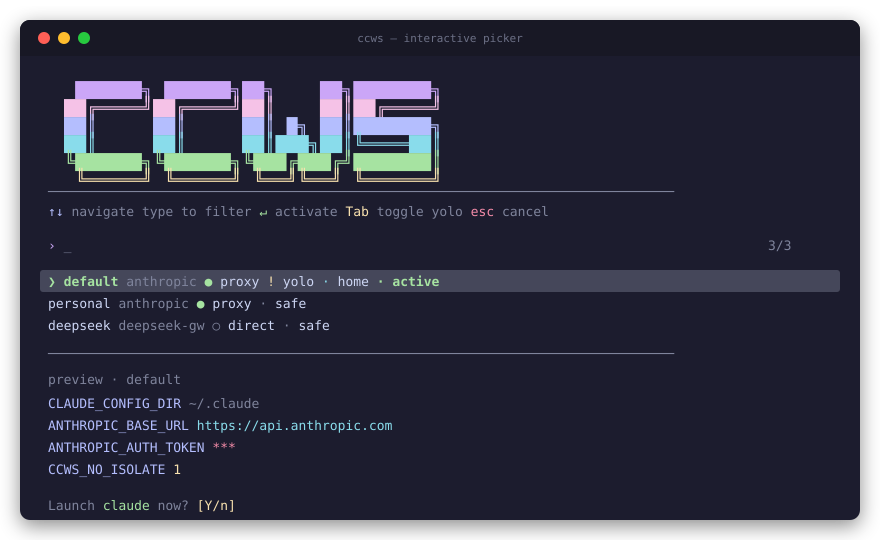
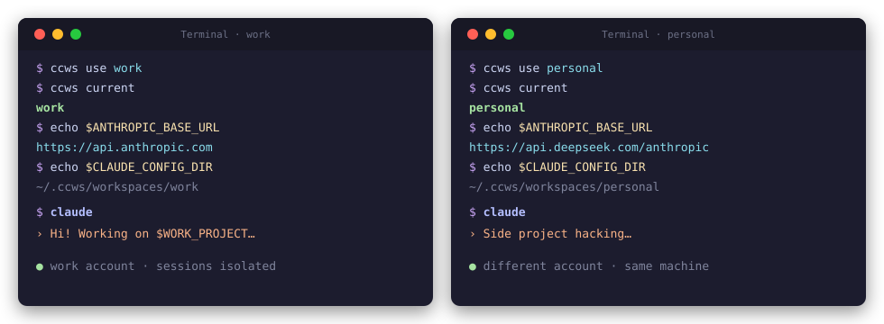
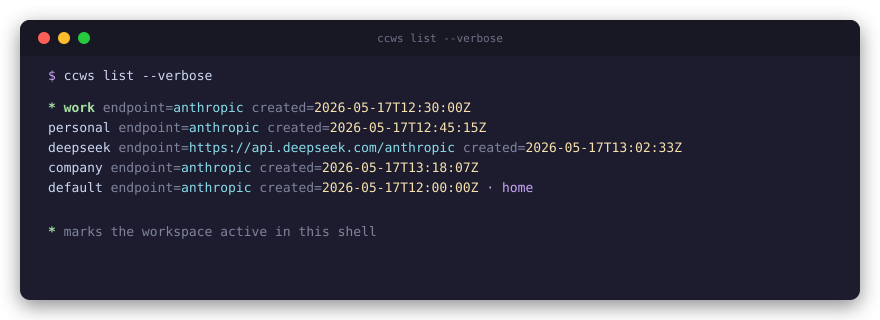
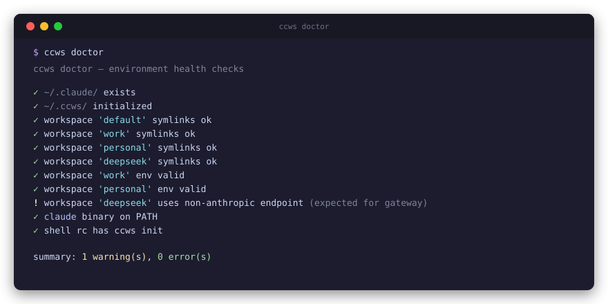

# ccws · Claude Code WorkSpace

> Per-shell Claude Code workspace switcher — run different accounts in different terminals, simultaneously, with shared plugin code and isolated auth.

<p align="center">
  
</p>

A single compiled binary (TypeScript / Bun) with zero runtime dependencies. No bash, no fzf install, no gum install.

## What this solves

If you have multiple Claude Code accounts (work, personal, third-party gateway like DeepSeek), you want to:
- Run them in different terminal windows **at the same time**, no auth conflicts
- Share plugin code (gstack, superpowers, etc.) — no need to install three times
- Switch with one command, or pick interactively from a TUI

`ccws` is `nvm` for Claude Code: a shell function that sets `CLAUDE_CONFIG_DIR` and endpoint env vars per shell.

## Relationship to other tools

| Tool | What it does | Different from ccws |
|---|---|---|
| [cc-switch](https://github.com/farion1231/cc-switch) | GUI account manager | Switches one account at a time, globally |
| [claude-account-switcher](https://github.com/ukogan/claude-account-switcher) | CLI account isolation | No multi-endpoint, no fish |
| ccws (this) | CLI + TUI + multi-endpoint + doctor + fish | Designed for terminal-heavy concurrent use |

ccws complements cc-switch — different problem, different solution.

## Quick start — zero to multi-account `claude` in 5 steps

```bash
# 1. Install (one-liner: downloads the binary + wires your shell rc)
curl -fsSL https://raw.githubusercontent.com/kolapapa/ccws/main/install.sh | bash

# 2. Restart shell (open a new terminal — don't just `source ~/.zshrc`,
#    because old `claude` shell functions stay in memory)

# 3. First-time user-config setup (slash commands + optional first workspace)
ccws init

# 4. Add an account (interactive — prompts for endpoint, token, proxy)
ccws add work
#  or one-liner:
ccws add work --base-url https://api.anthropic.com --token sk-... --proxy http://127.0.0.1:7890

# 5. Activate in this shell and launch
ccws use work && claude

# 6 (bonus). Pin a workspace to a directory (pyenv-style):
cd ~/projects/personal && ccws local personal
claude    # auto-uses 'personal' because the wrapper resolves .ccws-workspace
```

Each step modifies a different scope — see [Lifecycle at a glance](#lifecycle-at-a-glance) below for the full picture.

## Install

```bash
curl -fsSL https://raw.githubusercontent.com/kolapapa/ccws/main/install.sh | bash
```

What this does:
1. Detect platform (darwin/linux × arm64/x64) and download the matching binary from [GitHub Releases](https://github.com/kolapapa/ccws/releases)
2. Place at `~/.local/bin/ccws` + `chmod +x`
3. Append `eval "$(ccws hook --shell zsh)"` (or bash / fish equivalent) to your shell rc, plus a commented-out `eval "$(ccws hook --claude)"` line for the optional auto-activation wrapper (see [below](#why---with-claude-wrapper) to enable)

Verify:

```bash
ccws --version       # ccws 1.3.0
```

Then run `ccws init`.

### Options

```bash
./install.sh --with-claude-wrapper    # also enable the opt-in claude() auto-activation wrapper
./install.sh --no-shell-rc            # don't touch ~/.zshrc / ~/.bashrc / fish config
./install.sh --version v1.0.0         # pin to a specific release (default: latest)
```

### Upgrade

```bash
ccws upgrade                  # install latest release if newer than current
ccws upgrade --check          # print "current → latest" without downloading
ccws upgrade --version v1.0.0 # install / downgrade to a specific version
```

`ccws upgrade` overwrites `~/.local/bin/ccws` (or wherever the binary resolves via `realpath`) with the matching GitHub Release artifact for your platform. Shell rc is left alone — that's `install.sh`'s job at first install.

After upgrade, restart your shell so the `ccws()` function re-evals from the new binary:

```bash
exec $SHELL -l
```

If `ccws` is a symlink (developer mode, `--from-source`), `upgrade` refuses rather than break your dev tree. Rebuild with `bun run build:host` instead.

### Developer mode

If you've cloned the repo and want to use the source tree:

```bash
bun install
bun run build:host
ln -sfn "$(pwd)/dist/ccws-host" "$HOME/.local/bin/ccws"
```

This lets you edit `src/**` and re-run `bun run build:host` to test changes locally.

### Why `--with-claude-wrapper`?

Without it: `claude` runs the real binary. You must `ccws use <name>` first in each shell to pick a workspace.

With it: when you run `claude`, the wrapper checks if a workspace is implicitly set via `.ccws-workspace` (in `$PWD` or any parent) or `~/.ccws/global`. If yes, it runs claude in a subshell with that workspace's env — **without mutating your shell**. Like `pyenv` shims `python`.

**Enable it later (already installed without the flag?)** The default install writes the wrapper line commented-out in your rc. Open `~/.zshrc` (or `~/.bashrc` / `~/.config/fish/config.fish`), uncomment `eval "$(ccws hook --claude)"`, then restart your shell. To turn it off again, re-comment that line.

Conflict warning: if you have an existing `claude` shell function (e.g. from a custom `~/.zsh/claude.sh` profile manager), the ccws wrapper will replace it. Comment out the old `source` line first.

## Lifecycle at a glance

| Step | Command | What it modifies | When you run it |
|---|---|---|---|
| **1. Install** | `curl ... | bash` | `~/.local/bin/ccws` · `~/.zshrc` (hook line) | Once per machine |
| **2. Init** | `ccws init` | `~/.claude/commands/{whoami,switch}.md` · `~/.ccws/workspaces/default/` (home anchor) · optionally `~/.claude/` itself | Once per user |
| **3. Add workspace** | `ccws add NAME [...]` | `~/.ccws/workspaces/NAME/` (env + symlinks) | Once per additional account |
| **4. Activate (per-shell)** | `ccws use NAME` | Current shell's env vars (`CLAUDE_CONFIG_DIR`, `ANTHROPIC_*`, proxy…) | Each switch |
| **4b. Or pin (per-dir)** | `ccws local NAME` | `.ccws-workspace` file in `$PWD` | Once per project dir |
| **4c. Or pin (per-user)** | `ccws global NAME` | `~/.ccws/global` | Once, as a default |
| **5. Run** | `claude` | (just runs claude; wrapper auto-resolves if `--with-claude-wrapper`) | Daily |
| **6. Inspect / maintain** | `ccws list` · `ccws which` · `ccws doctor` · `ccws sync` | (reads only) | As needed |

Each step touches a different layer:

```
machine-level     install.sh             → ~/.local/bin/ccws + ~/.zshrc
user-config       ccws init              → ~/.claude/commands/
workspace-config  ccws add <name>        → ~/.ccws/workspaces/<name>/
shell-scope       ccws use <name>        → THIS shell's env
dir-scope         ccws local <name>      → ./.ccws-workspace
user-default      ccws global <name>     → ~/.ccws/global
```

## First-time setup · `ccws init`

`ccws init` is the entry point for new users. 4 steps:

1. **Detect `~/.claude/`** — if present, your existing setup stays as-is (plain `claude` keeps using it). If missing, optionally bootstrap an empty `~/.claude/` as the shared plugin store
2. **Install slash commands** `/whoami` and `/switch` into `~/.claude/commands/`
3. **Create the `default` home workspace** (forced) — this is the anchor. When active, claude uses `~/.claude/` directly (no private `CLAUDE_CONFIG_DIR`). Optionally pin everyday API config (token / endpoint / proxy) here, or leave blank to inherit whatever `~/.claude/settings.json` has
4. **Optionally add another (isolated) workspace** — for a different account or gateway (Anthropic / DeepSeek / Kimi / etc.). Isolated workspaces own their own `CLAUDE_CONFIG_DIR` but still share `plugins/`, `skills/`, `settings.json` via symlinks back to `~/.claude/`

**Mental model — `default` is the install anchor:**

| | Node | Claude Code (ccws) |
|---|---|---|
| Anchor (shared install) | `node` (system install) | `ccws use default && claude` → reads `~/.claude/` directly |
| Managed alternates | `nvm use 18 && node` | `ccws use work && claude` → reads `~/.ccws/workspaces/work/`, plugins symlinked from `~/.claude/` |

**Why force `default`?** Some plugins (e.g. `claude-hud`) hardcode paths under `~/.claude/` and break when `CLAUDE_CONFIG_DIR` points elsewhere. Installing them from `default` writes to the real `~/.claude/`, so every isolated workspace inherits them through the symlink farm — no per-workspace re-install, no broken paths.

Idempotent: re-running shows status instead of repeating setup. Use `ccws init --reset` to wipe and restart.

## Usage

```bash
# Interactive picker (the recommended entry)
$ ccws

# Interactive add (prompts for name / endpoint / token):
$ ccws add

# Or one-liner CLI:
$ ccws add work --base-url https://api.anthropic.com --token sk-...
$ ccws add personal
$ ccws add deepseek --base-url https://api.deepseek.com/anthropic --token sk-...

$ ccws list
$ ccws use work
$ ccws current
$ ccws doctor

# In another terminal, simultaneously:
$ ccws use personal && claude  # different account, same time, no conflict
```

## Directory-scoped workspaces (pyenv-style)

`ccws` resolves the active workspace from three sources, in priority order:

1. `CCWS_NAME` env var — set by `ccws use <name>` (shell scope)
2. `.ccws-workspace` file in `$PWD` or any parent (directory scope)
3. `~/.ccws/global` (user default)
4. Nothing — `claude` falls back to plain `~/.claude/`

```bash
# In a project directory, pin a workspace:
cd ~/work/projectA
ccws local company              # writes .ccws-workspace

# Set a user-wide default:
ccws global personal            # writes ~/.ccws/global

# Inspect resolution:
ccws which                      # prints: company
ccws which --explain            # also prints the source (local/global/shell)

# Activate the resolved workspace in the current shell:
ccws use $(ccws which)
```

For automatic activation (so `claude` in any directory auto-picks up the scope), see the `claude` wrapper section above.

## `claude` wrapper · how auto-activation works

Enabled by `./install.sh --with-claude-wrapper` (or manually via `eval "$(ccws hook --claude)"` in your rc). Once enabled, every `claude` invocation goes through this resolution chain:

```
1. CCWS_NAME already set? (you ran `ccws use foo`)   → just exec real claude
2. .ccws-workspace found in $PWD or any parent?      → spawn subshell with that workspace, exec claude
3. ~/.ccws/global is set?                            → spawn subshell with that workspace, exec claude
4. Nothing matches                                    → exec real claude (uses ~/.claude/)
```

Steps 2 and 3 spawn a **subshell** — your parent shell's `$ANTHROPIC_BASE_URL` etc. stay untouched. This is pyenv's shim model.

```bash
cd ~/work/projectA && claude      # uses ./.ccws-workspace's workspace
cd ~/personal && claude           # uses different workspace
cd /tmp && claude                 # uses ~/.ccws/global, or plain claude

# Explicit shell override always wins:
ccws use company
claude                            # uses company regardless of $PWD
```

### Switching accounts mid-session · `/switch`

Ran out of quota on one account? Inside Claude, run `/switch <workspace>`. It
captures the current session and asks you to press Ctrl-D. When claude exits, the
wrapper switches accounts and relaunches `claude --resume` on **the exact session
you were in** — the conversation continues under the new account:

```
/switch deepseek          # in Claude → arms the switch, captures this session
<Ctrl-D>                  # you exit
  → ccws use deepseek     # wrapper swaps token / endpoint
  → claude --resume <id>  # same conversation, new account
```

Under the hood `/switch` runs `ccws switch <name> <session-id>`, which writes a
one-shot marker (`~/.ccws/next-workspace`) that the wrapper consumes on the next
launch. It works because session history (`projects/`) is shared across all
workspaces (see below), so the session is visible under the new account. Requires
the `claude` wrapper (`--with-claude-wrapper`); without it, exit and run
`ccws use <name> && claude --resume` by hand.

## Home workspaces · `CCWS_NO_ISOLATE=1`

A normal (isolated) ccws workspace owns its own `CLAUDE_CONFIG_DIR` — Claude Code reads sessions and `.claude.json` from `~/.ccws/workspaces/<name>/`. Shared items (`plugins/`, `skills/`, `settings.json`, `commands/`, `hooks/`, `projects/`, ...) are symlinked back to `~/.claude/`. Sharing `projects/` means conversation history follows you across accounts — that's what lets `/switch` resume the same session under a different workspace.

A **home workspace** drops the private `CLAUDE_CONFIG_DIR` entirely: Claude Code reads everything (including sessions) from `~/.claude/`. Use cases:

- The auto-created `default` workspace — the install anchor for plugins that hardcode `~/.claude/` paths
- Pinning your everyday API config (token / endpoint / proxy / model) without isolating any state

`ccws init` creates `default` for you with `CCWS_NO_ISOLATE=1`. To create an **additional** home workspace later:

```bash
ccws add work-home --base-url https://api.anthropic.com --token sk-...
echo 'CCWS_NO_ISOLATE=1' >> ~/.ccws/workspaces/work-home/ccws.env
```

When a home workspace is activated:
- `CCWS_NAME=<name>` is exported (picker / `ccws current` still identify it)
- **`CLAUDE_CONFIG_DIR` is NOT exported** — Claude Code falls back to `~/.claude/`
- Token / endpoint / proxy / custom env still ship as usual

In the picker, home workspaces:
- **Sort first** (above all isolated workspaces)
- Show a `· home` marker on the row
- Preview's `CLAUDE_CONFIG_DIR` displays `~/.claude` (clear visual signal that they share the global dir)

**Recommended workflow:** install plugins from `default` so writes land in `~/.claude/{plugins,settings.json,...}`. Every other workspace inherits them through its symlink farm — no re-install, no broken hardcoded paths.

## Proxy per workspace

Some Claude endpoints (Anthropic direct from certain regions) need an HTTP/SOCKS proxy. Others (gateway endpoints like DeepSeek) don't. ccws supports per-workspace proxy settings:

```bash
# Interactive add prompts for proxy:
$ ccws add anth
Endpoint URL (Anthropic default, blank to skip): https://api.anthropic.com
API token (paste, hidden; blank to skip): sk-***
Enable proxy? [y/N]: y
Proxy URL [http://127.0.0.1:7890]:

# Or one-liner:
$ ccws add anth --base-url https://api.anthropic.com --token sk-x --proxy http://127.0.0.1:7890
```

Stored as `HTTPS_PROXY=` / `HTTP_PROXY=` in `ccws.env`. Switching workspaces auto-unsets them so a non-proxy workspace doesn't leak through.

For SOCKS or fine-grained control, append directly to `ccws.env`:

```bash
cat >> ~/.ccws/workspaces/anth/ccws.env <<'EOF'
ALL_PROXY=socks5://127.0.0.1:7890
NO_PROXY=localhost,127.0.0.1,.internal
EOF
```

## Custom env vars per workspace

`ccws use` exports **every** key in the workspace's `ccws.env` file (except a few internal metadata keys). Add anything Claude Code or its plugins read — model routing, effort level, attribution headers, OpenAI-compat keys for gateways, etc.:

```bash
ccws add deepseek --base-url https://api.deepseek.com/anthropic --token sk-xxx

cat >> ~/.ccws/workspaces/deepseek/ccws.env <<'EOF'
ANTHROPIC_MODEL=deepseek-v4-pro[1m]
ANTHROPIC_DEFAULT_OPUS_MODEL=deepseek-v4-pro[1m]
ANTHROPIC_DEFAULT_SONNET_MODEL=deepseek-v4-pro[1m]
ANTHROPIC_DEFAULT_HAIKU_MODEL=deepseek-v4-flash
CLAUDE_CODE_SUBAGENT_MODEL=deepseek-v4-flash
CLAUDE_CODE_EFFORT_LEVEL=max
CLAUDE_CODE_ATTRIBUTION_HEADER=0
EOF

ccws use deepseek
echo $ANTHROPIC_MODEL    # deepseek-v4-pro[1m]
claude
```

Switching workspaces (`ccws use <other>`) automatically unsets the previous workspace's vars first — no stale `ANTHROPIC_MODEL` leaking across accounts. The `CCWS_EXPORTED` variable tracks what's currently active.

**Hidden keys:** `CCWS_NAME`, `CCWS_CREATED`, `CCWS_DESCRIPTION`, `CCWS_NO_ISOLATE` are internal ccws metadata — they're not exported into the claude process (CCWS_NAME is re-set explicitly so picker / `ccws current` can identify the active workspace). Any `*_TOKEN` / `*_AUTH` / `*_AUTH_TOKEN` / `*_KEY` key is **masked as `***`** in the preview pane (the value still ships to claude, just doesn't display on screen).

## What it looks like

### Interactive picker (`ccws` with no args)

The picker is a React/Ink TUI built into the binary — no fzf / gum install needed:

```
   ██████╗ ██████╗██╗    ██╗███████╗       ← 6-row Catppuccin gradient logo
  ██╔════╝██╔════╝██║    ██║██╔════╝          (mauve → pink → lavender →
  ██║     ██║     ██║ █╗ ██║███████╗           sky → green → yellow)
  ██║     ██║     ██║███╗██║╚════██║
  ╚██████╗╚██████╗╚███╔███╔╝███████║
   ╚═════╝ ╚═════╝ ╚══╝╚══╝ ╚══════╝
  ────────────────────────────────
  ↑↓ navigate    type to filter    ↵ activate    Tab toggle yolo    esc cancel

  › _                                                3/3

❯ default       anthropic                 ● proxy   ! yolo   · home
  personal      anthropic                 ● proxy   · safe
  deepseek      deepseek-gw               ○ direct  · safe
  ────────────────────────────────
  CLAUDE_CONFIG_DIR   ~/.claude
  ANTHROPIC_BASE_URL  https://api.anthropic.com
  ANTHROPIC_AUTH_TOKEN ***
```

- ↑↓ wraps at the edges · type to fuzzy-filter · `Tab` toggles `CCWS_DANGEROUS` on the cursor row (the `! yolo` marker)
- Selected row gets a full-line inverse highlight (Catppuccin dim background, fg-colored text)
- Home workspaces (`CCWS_NO_ISOLATE=1`) sort first and show `· home`
- The active workspace (the one currently `ccws use`d in this shell) is bold-green with a `· active` suffix
- Preview pane at the bottom shows `CLAUDE_CONFIG_DIR` + every key from the workspace's `ccws.env` (alphabetical, secrets masked)

After selecting, ccws asks `Launch claude now? [Y/n]` — press Enter and you're inside Claude with the chosen workspace active.

### Multi-shell concurrent — the killer feature

<p align="center">
  
</p>

Each terminal exports its own `CLAUDE_CONFIG_DIR` and endpoint env vars. Plugin code is shared via symlinks — install once, work everywhere.

### `ccws list --verbose`

<p align="center">
  
</p>

`*` marks the workspace currently active in **this** shell.

### `ccws doctor`

<p align="center">
  
</p>

Color-coded: `✓` green ok · `!` yellow warning · `✗` red error.

## Architecture

- ccws is a single compiled binary (~60 MB darwin / ~95 MB linux), built from TypeScript with Bun's `bun build --compile`
- Each workspace is a directory at `~/.ccws/workspaces/<name>/` and serves as `CLAUDE_CONFIG_DIR` (unless `CCWS_NO_ISOLATE=1`)
- A symlink farm shares plugins, skills, settings, MCP, hooks, etc. from `~/.claude/` into each workspace
- `ccws use <name>` writes `export KEY=value` lines to stdout — the shell wrapper (`eval "$(ccws hook --shell zsh)"`) eval's them, mutating the current shell
- The picker is built with Ink (React-on-terminal) — selected row cursor sticks across Tab toggles, no fzf-style line-content remapping
- Multiple shells can each have their own active workspace — no shared state mutation

## Commands

```
ccws                       Open interactive TUI picker (Ink / Catppuccin)
ccws init                  First-time setup wizard
ccws add [<name>]          Create a workspace (interactive if no args)
                           [--base-url URL] [--token TOK] [--binary PATH]
                           [--proxy URL] [--description DESC]
                           [--non-interactive]
ccws use <name>            Activate workspace in current shell
ccws unset                 Deactivate workspace in current shell
ccws switch <name>         Arm an account switch for the next claude launch
                           (used by the /switch slash command)
ccws local <name>          Set .ccws-workspace in $PWD (pyenv-style)
ccws local --unset         Remove .ccws-workspace
ccws global <name>         Set user-default workspace
ccws global --unset        Clear user-default
ccws which [--explain]     Resolve active workspace (shell > local > global)
ccws hook --shell zsh      Emit init code (eval in ~/.zshrc)
ccws hook --claude         Emit claude() wrapper (opt-in auto-activation)
ccws list [--verbose]      List all workspaces
ccws current [--path]      Show currently active workspace
ccws rm <name> [-f]        Remove workspace
ccws doctor                Run health checks
ccws sync [<name>]         Re-link symlinks for one or all workspaces
ccws upgrade [--check]     Upgrade to latest GitHub release
                           [--version vX.Y.Z]
ccws --version             Print ccws 1.3.0
ccws --no-tui              Bypass TUI when called without args
ccws --help                Show this help
```

## License

MIT
